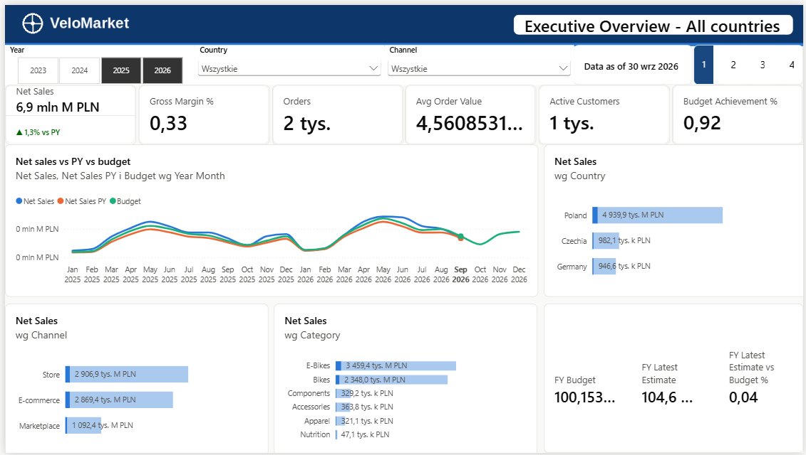
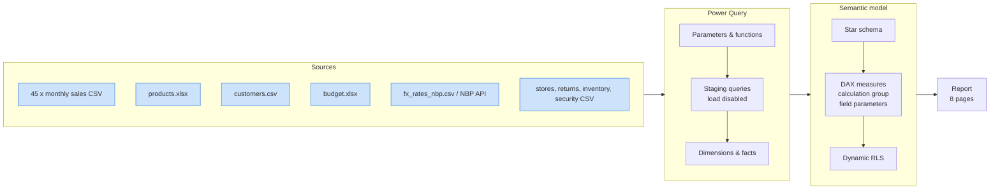
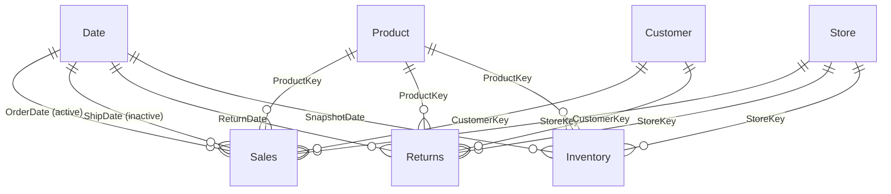

# VeloMarket – Sales & Customer Analytics (Power BI)

End-to-end Power BI solution for **VeloMarket**, a fictional omnichannel bike & outdoor retailer operating
**9 stores, 3 web shops and a marketplace in Poland, Czechia and Germany**.
The project covers the full BI developer workflow: messy multi-source ETL in Power Query, a star-schema semantic model
with four fact tables at different grains, advanced DAX, calculation groups, dynamic RLS, performance tuning
and source control in the **PBIP / TMDL** format.



---

## Business questions

| Stakeholder | Question answered by the report |
|---|---|
| Management | How are sales and margin tracking vs last year and vs budget? What is the full-year **latest estimate**? |
| Sales director | Which countries, channels and stores grow? What is the **like-for-like** growth excluding new stores? |
| CRM / Marketing | How many customers are new vs returning? How do **cohorts retain**? Which customers are **at risk** (RFM)? |
| Category management | Which products make 80% of revenue (**ABC/Pareto**)? What is bought together (**market basket**)? What gets returned? |
| Supply chain | How much stock do we hold, how many **days of supply**, where are **stock-outs**? |
| Country managers | Each manager sees only their own country (**dynamic RLS**). |

## Dataset

Synthetic but realistic data (Jan 2023 – Sep 2026, current year in progress) generated with Python
([`data/generator/generate_data.py`](data/generator/generate_data.py)). See the [data dictionary](docs/data_dictionary.md).

| | |
|---|---|
| Sales lines / orders | ~122k / ~69k |
| Customers | ~24.5k |
| Products | 110 SKUs in 6 categories |
| Currencies | PLN, CZK, EUR (converted with monthly NBP rates) |
| Other facts | returns, month-end inventory snapshots, yearly budget (Excel) |

The raw files deliberately contain issues a BI developer meets in real life: 45 monthly ERP exports in a folder,
duplicated lines, QA test orders, inconsistent keys, a report-style Excel export, CRM history rows, Polish-locale CSV,
a wide budget sheet with totals.

## Architecture



### Data model



- `Budget` (month × country × category) has **no physical relationships**. It is connected virtually with `TREATAS`
  and allocated to days, so it can be compared at any date granularity.
- Single-direction relationships only, integer surrogate keys, technical members for unknown products / anonymous customers.
- Disconnected helper tables: RFM segments, cohort offsets, Top N, market-basket axis, security mapping.

## Power Query highlights

Code of every query: [`powerquery/`](powerquery/)

- **Folder ingestion through a custom function** (`fnParseSalesFile`) with an explicit table type instead of auto-generated "Combine Files" helpers.
- **Data quality:** SKU normalisation, de-duplication of re-exported lines, removal of QA test orders,
  latest-record de-duplication of CRM history (`Table.Buffer` + `Table.Distinct`), country mapping via a record lookup.
- **Locale-aware parsing** of a Polish CSV (`;`, decimal comma), **unpivot** of wide FX and budget tables, all budget sheets picked up dynamically.
- **Currency conversion** via a two-column merge (month + currency).
- **Calendar built in M** with ISO weeks; year range derived from file names (no fact scan).
- Parameterised source path; staging queries not loaded; (bonus) NBP REST API function with 90-day paging and `RelativePath` for Service refresh.

## DAX highlights

60+ measures organised in display folders. A few examples:

**Previous year that respects an incomplete current year**
```dax
Net Sales PY =
CALCULATE (
    [Net Sales],
    CALCULATETABLE ( DATEADD ( 'Date'[Date], -1, YEAR ), 'Date'[Date With Sales] = TRUE )
)
```

**Budget at a different grain – virtual relationships + allocation to days** (simplified; the full measure also hides the budget below its grain)
```dax
Budget =
SUMX (
    VALUES ( 'Date'[Year Month Key] ),
    VAR _daysInMonth = CALCULATE ( COUNTROWS ( 'Date' ), ALLEXCEPT ( 'Date', 'Date'[Year Month Key] ) )
    VAR _daysSelected = CALCULATE ( COUNTROWS ( 'Date' ) )
    VAR _monthBudget = CALCULATE ( [Budget (Monthly Grain)], ALLEXCEPT ( 'Date', 'Date'[Year Month Key] ) )
    RETURN DIVIDE ( _monthBudget * _daysSelected, _daysInMonth )
)
```

**Like-for-like growth – same store set for both periods**
```dax
LFL Net Sales =
VAR _periodStart = MIN ( 'Date'[Date] )
VAR _lflStores =
    CALCULATETABLE ( VALUES ( Store[StoreKey] ), Store[Open Date] <= EDATE ( _periodStart, -12 ) )
RETURN
    CALCULATE ( [Net Sales], KEEPFILTERS ( _lflStores ) )
```

Other patterns implemented: new vs returning customers, **cohort retention matrix**, **dynamic RFM segmentation**,
ABC / Pareto, **Top N + Others**, **market-basket analysis**, semi-additive inventory (closing balance, days of supply,
out-of-stock rate), latest estimate, order-based return rate (fact-to-fact `TREATAS`), role-playing date (`USERELATIONSHIP`),
window functions (`OFFSET`), SVG micro-charts.

**Modern Power BI features:** calculation group *Time Intelligence* (PY, YoY, YoY %, YTD, PY YTD, YTD YoY %, Rolling 12M),
field parameters for metric & dimension switching, dynamic format strings (`81.5 M PLN` / `350.2 k PLN`), What-if parameter.

## Report pages

| # | Page | Screenshot |
|---|---|---|
| 1 | Executive Overview: KPIs vs PY & budget, trend, latest estimate | `images/01_executive_overview.png` |
| 2 | Sales Performance: field parameters, decomposition tree, Top N + Others, LFL by store | `images/02_sales_performance.png` |
| 3 | Customers: new vs returning, cohort retention heatmap, RFM | `images/03_customers.png` |
| 4 | Products & Returns: Pareto/ABC, margin vs sales, market basket, return reasons | `images/04_products_returns.png` |
| 5 | Budget vs Actual: variance by country & category, waterfall, YTD vs budget | `images/05_budget_vs_actual.png` |
| 6 | Inventory: stock value, days of supply, out-of-stock heatmap | `images/06_inventory.png` |
| 7 | Store Details: drill-through page | `images/07_store_drillthrough.png` |
| 8 | Category tooltip page | `images/08_tooltip.png` |

UX: page navigator, bookmarks (chart/table toggle, reset filters), synced slicers, edited interactions,
custom colour-blind-safe theme ([`theme/velomarket_theme.json`](theme/velomarket_theme.json)), alt text on visuals.

## Security

Dynamic row-level security with a single role driven by a user-to-country mapping table and `USERPRINCIPALNAME()`,
including an `ALL` access level and explicit security on tables connected only virtually (Budget).
Tested with *View as* for country managers, a multi-country director and the CEO.

## How to open

1. Install Power BI Desktop (Windows).
2. Open `VeloMarket.pbip` (or `VeloMarket.pbix`).
3. *Transform data → Edit parameters* → set `pDataFolder` to the full path of `data\raw\` on your machine (ending with `\`) → *Apply changes*.

## Repository structure

```
├── VeloMarket.pbip               Power BI project file
├── VeloMarket.SemanticModel/     semantic model in TMDL (tables, measures, relationships, RLS, M code)
├── VeloMarket.Report/            report definition
├── data/raw/                     source files
├── data/generator/               Python data generator
├── powerquery/                   M code of every query (readable copy)
├── theme/                        report theme
├── docs/                         data dictionary, measure dictionary
└── images/                       screenshots
```

## Tools

Power BI Desktop · Power Query (M) · DAX · DAX Studio · Tabular Editor 2 · Git (PBIP/TMDL) · Python (data generation)
